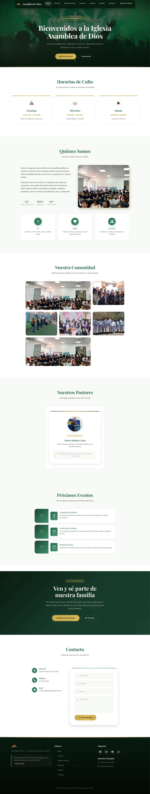

# Iglesia Asamblea de Deus - Site Web

<div align="center">


**Site web institucional da Iglesia Asamblea de Deus**

Uma plataforma completa com painel de administração, gestão de eventos e anúncios,
equipe pastoral, recursos para download e sistema de autenticação JWT.

</div>

---

[English](README.md) | [Español](README.es.md) | [Português](README.pt.md)

---

## 🎨 Protótipo de Design

O design visual, a estrutura e a experiência do usuário (UX/UI) foram planejados e aprovados usando um protótipo inicial.

<div align="center">
  
</div>

## Índice

- [Sobre](#sobre)
- [Funcionalidades](#funcionalidades)
- [Tecnologias](#tecnologias)
- [Arquitetura](#arquitetura)
- [Estrutura do Projeto](#estrutura-do-projeto)
- [Início Rápido](#início-rápido)
- [Scripts Disponíveis](#scripts-disponíveis)
- [Rotas](#rotas)
- [Autenticação](#autenticação)
- [Referência da API](#referência-da-api)
- [Banco de Dados](#banco-de-dados)
- [Animações de Scroll](#animações-de-scroll)
- [Configuração](#configuração)
- [Solução de Problemas](#solução-de-problemas)
- [Roadmap](#roadmap)
- [Contribuir](#contribuir)
- [Licença](#licença)

---

## Sobre

Este é o site oficial da **Iglesia Asamblea de Deus**, projetado para compartilhar
informações sobre horários de culto, eventos, pastores, história da igreja e
dados de contato. Inclui um painel de administração completo com autenticação
segura JWT.

### Por que este projeto?

- **Frontend Moderno**: React 19 + Vite 8 + TypeScript com JSX e Fast Refresh
- **Backend Robusto**: Node.js + Express 5 + TypeScript com autenticação JWT
- **Banco de Dados**: MySQL 8.0 rodando em Docker
- **Design Premium**: Glassmorphism, animações de scroll e totalmente responsivo
- **CRUD Completo**: Gestão de eventos, anúncios, pastores, recursos e mensagens pelo painel admin

---

## Funcionalidades

### Páginas Públicas

| Página | Rota | Descrição |
|--------|------|-----------|
| **Início** | `/` | Hero carrossel em tela cheia (Swiper com 3 slides: boas-vindas, noite de jovens, batismos) com botões CTA, animações de scroll e layout de uma coluna |
| **Horários** | `/horarios` | Cards dinâmicos com ícones para domingos, quartas e sábados |
| **Quem Somos** | `/quienes-somos` | Layout de 2 colunas com imagem, história, valores e métricas |
| **Galeria** | `/quienes-somos` | Bento grid com 6 espaços para fotos da congregação |
| **Pastores** | `/pastores` | Perfis da equipe pastoral com fotos reais e anéis decorativos |
| **Eventos** | `/eventos` | Carrossel interativo de eventos com cards (Swiper), mais lista cronológica em `/eventos` |
| **Anexos** | `/anexos` | Sedes da igreja com info do pastor, endereço, horário e contato |
| **Redes Sociais** | `/redes` | Cards com links para os perfis sociais oficiais (Facebook, Instagram, YouTube, TikTok) |
| **CTA** | `/` (seção) | Banner motivacional em tela cheia com partículas decorativas |
| **Contato** | `/contacto` | Formulário de contato e dados da congregação |

### Painel de Administração

| Funcionalidade | Descrição |
|----------------|-----------|
| **Login Seguro** | Formulário com email/senha, toggle de visibilidade, "Lembrar email" e proteção JWT |
| **Dashboard Premium** | Banner interativo, saudação dinâmica, relógio em tempo real e cards glassmorphism |
| **Estatísticas** | Métricas dinâmicas conectadas ao BD: total de membros, eventos e mensagens |
| **Gerenciador de Eventos** | CRUD completo: listagem em tabela, modal de criação/edição, exclusão e upload de imagem |
| **Gerenciador de Anúncios** | CRUD completo: publicar anúncios para a congregação com upload de imagem |
| **Equipe Pastoral** | CRUD completo: gestão de líderes (nomes, cargos, biografias) com upload de foto |
| **Gerenciador de Recursos** | CRUD completo: materiais para download (PDFs) com upload de arquivo |
| **Caixa de Mensagens** | Leitura e exclusão de mensagens recebidas do formulário público |
| **Logout** | Encerramento de sessão com limpeza completa do token JWT |

### Gerais

- **Design Responsivo**: Compatível com celular, tablet e desktop (3 breakpoints: 991px, 767px, 575px)
- **SPA Fluida**: Navegação entre páginas sem recarregamento usando React Router
- **UI Premium**: Glassmorphism na NavBar, hamburger customizado e efeitos hover/shimmer
- **Animações de Scroll**: Elementos em cascata ao fazer scroll com IntersectionObserver
- **Footer Persistente**: Versículo destacado, redes sociais e horários nas rotas públicas
- **Paleta de Cores**: Verde floresta + dourado eclesiástico com CSS custom properties
- **Acessibilidade**: aria-labels, focus-visible, HTML semântico, contraste WCAG

---

## Tecnologias

### Frontend

| Tecnologia | Versão | Descrição |
|------------|--------|-----------|
| [React](https://react.dev/) | ^19.2.7 | Biblioteca para interfaces de usuário |
| [TypeScript](https://www.typescriptlang.org/) | ^7.0.2 | Verificação estática de tipos |
| [Vite](https://vite.dev/) | ^8.1.1 | Servidor de desenvolvimento e bundler |
| [React Router](https://reactrouter.com/) | ^7.18.1 | Roteamento SPA |
| [Bootstrap](https://getbootstrap.com/) | ^5.3.8 | Framework CSS (grid, utilidades) |
| [React Bootstrap](https://react-bootstrap.github.io/) | ^2.10.10 | Componentes Bootstrap para React |
| [Bootstrap Icons](https://icons.getbootstrap.com/) | ^1.13.1 | Biblioteca de ícones |
| [Tailwind CSS](https://tailwindcss.com/) | ^3.4.19 | Framework CSS utilitário (paleta personalizada) |
| [Swiper](https://swiperjs.com/) | ^14.0.6 | Biblioteca de sliders/carrosséis táteis |
| [OxLint](https://oxc.rs/) | ^1.71.0 | Linter ultrarrápido |

### Backend

| Tecnologia | Versão | Descrição |
|------------|--------|-----------|
| [Node.js](https://nodejs.org/) | >= 18 | Runtime de JavaScript |
| [TypeScript](https://www.typescriptlang.org/) | ^7.0.2 | Verificação estática de tipos |
| [Express](https://expressjs.com/) | ^5.2.1 | Framework web para Node.js |
| [MySQL2](https://github.com/sidorares/node-mysql2) | ^3.22.6 | Driver de MySQL |
| [bcrypt](https://www.npmjs.com/package/bcrypt) | ^6.0.0 | Hashing seguro de senhas |
| [jsonwebtoken](https://www.npmjs.com/package/jsonwebtoken) | ^9.0.3 | Geração e verificação de JWT |
| [cors](https://www.npmjs.com/package/cors) | ^2.8.6 | Cross-Origin Resource Sharing |
| [multer](https://www.npmjs.com/package/multer) | ^2.2.0 | Gerenciamento de upload de arquivos (imagens + PDFs) |
| [dotenv](https://www.npmjs.com/package/dotenv) | ^17.4.2 | Variáveis de ambiente a partir do .env |

### Banco de Dados

| Tecnologia | Versão | Descrição |
|------------|--------|-----------|
| [MySQL](https://www.mysql.com/) | 8.0 | Banco de dados relacional (via Docker) |
| [Docker Compose](https://docs.docker.com/compose/) | - | Orquestração de contêineres |

---

## Arquitetura

```
┌─────────────────────────────────────────────────┐
│                  FRONTEND (Vite)                │
│  React 19 + TypeScript + React Router 7         │
│  + Bootstrap 5 + Tailwind · Porta: 5173         │
│                                                 │
│  ┌───────────┐  ┌───────────┐  ┌─────────────┐ │
│  │   Pages    │  │Components │  │   Context   │ │
│  │ Home       │  │ NavBar    │  │ AuthContext  │ │
│  │ Login      │  │ Footer    │  │  (user,     │ │
│  │ Admin      │  │ Layout    │  │   token,    │ │
│  │ Horários   │  │ PageHeader│  │   login,    │ │
│  │ Eventos... │  │ 14 total  │  │   logout)   │ │
│  └───────────┘  └───────────┘  └─────────────┘ │
│                      │                          │
│              Vite Proxy (/api → 3307)           │
└──────────────────────┼──────────────────────────┘
                       │
┌──────────────────────┼──────────────────────────┐
│               BACKEND (Express)                 │
│  Node.js + Express 5                            │
│  Porta: 3307                                    │
│                                                 │
│  ┌──────────────────────────────────────────┐   │
│  │  POST /api/auth/login                    │   │
│  │  CRUD /api/eventos  (upload de imagem)   │   │
│  │  CRUD /api/pastores  (upload de foto)    │   │
│  │  CRUD /api/anuncios  (upload de imagem)  │   │
│  │  CRUD /api/recursos  (upload de PDF)     │   │
│  │  GET,DELETE /api/mensajes                │   │
│  │  GET /api/health · /uploads (estático)   │   │
│  └──────────────────────────────────────────┘   │
│                      │                          │
│              MySQL2 Driver                      │
└──────────────────────┼──────────────────────────┘
                       │
┌──────────────────────┼──────────────────────────┐
│               DATABASE (MySQL 8.0)              │
│  Contêiner Docker - Porta Host 33007 → 3306     │
│  Banco de dados: iglesia_db                     │
│                                                 │
│  ┌──────────┐ ┌────────┐ ┌──────────┐          │
│  │ usuarios │ │eventos │ │ pastores │          │
│  ├──────────┤ ├────────┤ ├──────────┤          │
│  │ anuncios │ │recursos│ │ mensajes │          │
│  │ horarios │ └────────┘ └──────────┘          │
│  └──────────┘                                  │
└─────────────────────────────────────────────────┘
```

---

## Estrutura do Projeto

```
Pagina-Iglesia/
├── public/                    # Arquivos estáticos servidos pelo Vite
│   └── img/                   # Imagens públicas (logo, galeria, pastores, hero)
├── src/                       # Código-fonte do frontend React
│   ├── api/                   # Cliente HTTP centralizado
│   │   └── index.ts           # Função fetchAPI com injeção automática de JWT + suporte FormData
│   ├── components/            # 14 componentes reutilizáveis
│   │   ├── Layout.tsx         # Layout principal com Outlet e Footer
│   │   ├── NavBar.tsx         # Barra de navegação responsiva com Glassmorphism
│   │   ├── Footer.tsx         # Rodapé com links, versículo e redes sociais
│   │   ├── PageHeader.tsx     # Cabeçalho de páginas internas (estilo hero)
│   │   ├── HeroSlider.tsx     # Hero carrossel em tela cheia (Swiper, 3 slides)
│   │   ├── Hero.tsx           # Hero de slide único (fallback)
│   │   ├── ScheduleSection.tsx# Cards de horários de culto com ícones
│   │   ├── AboutSection.tsx   # Seção "Quem Somos" (2 colunas + métricas)
│   │   ├── GallerySection.tsx # Galeria de fotos (Bento grid de 6 espaços)
│   │   ├── PastorsSection.tsx # Cards de pastores/líderes (foto real)
│   │   ├── EventsSection.tsx  # Lista de próximos eventos (com thumbnails)
│   │   ├── EventosSlider.tsx  # Carrossel interativo de eventos (Swiper, responsivo, autoplay)
│   │   ├── CTASection.tsx     # Seção "Chamada à ação" com partículas
│   │   └── ContactSection.tsx # Info de contato + formulário
│   ├── context/
│   │   └── AuthContext.tsx    # Provedor de autenticação (login/logout/JWT)
│   ├── hooks/
│   │   └── useScrollAnimations.ts # Hook de animações scroll (IntersectionObserver)
│   ├── pages/                 # Páginas e rotas da aplicação
│   │   ├── admin/             # Componentes de gestão CRUD (Painel Admin)
│   │   │   ├── AdminEventos.tsx
│   │   │   ├── AdminPastores.tsx
│   │   │   ├── AdminMensajes.tsx
│   │   │   ├── AdminAnuncios.tsx
│   │   │   └── AdminRecursos.tsx
│   │   ├── Home.tsx           # Página principal (hero slider + seções)
│   │   ├── Horarios.tsx       # Página de horários
│   │   ├── QuienesSomos.tsx   # Página "Quem Somos"
│   │   ├── Pastores.tsx       # Página de pastores
│   │   ├── Eventos.tsx        # Página de eventos
│   │   ├── Anexos.tsx         # Página de anexos/sedes com info de cada igreja
│   │   ├── RedesSociales.tsx  # Página de links para redes sociais
│   │   ├── Contacto.tsx       # Página de contato
│   │   ├── Login.tsx          # Formulário de login
│   │   └── Admin.tsx          # Painel de administração protegido (sidebar + 5 módulos)
│   ├── styles/
│   │   └── styles.css         # Estilos globais (diretivas Bootstrap + Tailwind, ~4600 linhas)
│   ├── App.tsx                # Definição de rotas (Router + Auth + ProtectedRoute)
│   └── main.tsx               # Ponto de entrada da app
├── backend/                   # Código-fonte do servidor Express
│   ├── server.ts              # Servidor Express com todos os endpoints API
│   ├── config.ts              # Configuração baseada em env (porta, JWT, BD, CORS)
│   ├── generarClave.ts        # Utilidade para gerar hashes bcrypt
│   ├── reseteo.ts             # Utilidade para redefinir senha do admin
│   ├── middleware/
│   │   ├── auth.ts            # Middleware de verificação JWT
│   │   └── upload.ts          # Configuração do Multer (imagens + PDFs, limite 5MB)
│   ├── uploads/               # Arquivos enviados servidos em /uploads (gitignored)
│   └── package.json           # Dependências do backend
├── index.html                 # HTML de entrada para o Vite
├── vite.config.ts             # Configuração do Vite (proxy API → 3307, plugin React)
├── tsconfig.json              # Configuração do TypeScript (frontend)
├── postcss.config.js          # PostCSS (Tailwind + Autoprefixer)
├── tailwind.config.js         # Tema personalizado do Tailwind (paleta, fontes, sombras)
├── docker-compose.yml         # Configuração do MySQL em Docker (porta 33007)
├── init.sql                   # Schema do banco de dados + dados de exemplo (executa automaticamente)
├── .env                       # Variáveis de ambiente (NÃO versionar)
├── example.env                # Modelo com placeholders + CORS_ORIGIN
├── .gitignore                 # Arquivos ignorados pelo Git
├── .oxlintrc.json             # Configuração do OxLint
├── .prettierrc                # Configuração do Prettier
├── .editorconfig              # Configuração do editor
└── README.md                  # Arquivo de documentação principal
```

---

## Início Rápido

### Pré-requisitos

- [Node.js](https://nodejs.org/) >= 18
- [npm](https://www.npmjs.com/) >= 9
- [Docker](https://www.docker.com/) (para MySQL)

### Instalação

```bash
# 1. Clonar o repositório
git clone <url-do-repositorio>
cd Pagina-Iglesia

# 2. Instalar dependências do frontend
npm install

# 3. Instalar dependências do backend
cd backend && npm install && cd ..

# 4. Configurar variáveis de ambiente
cp example.env .env
# Edite .env com suas credenciais de MySQL e um JWT_SECRET seguro

# 5. Iniciar MySQL no Docker (init.sql executa automaticamente na primeira vez)
docker-compose up -d

# 6. Iniciar o backend (Terminal 1)
cd backend && npm start

# 7. Iniciar o frontend (Terminal 2)
npm run dev
```

> **Nota:** `init.sql` é montado no diretório `/docker-entrypoint-initdb.d/` do contêiner, então ele é executado automaticamente na primeira criação do contêiner. Para uma importação manual posterior, use `mysql -h 127.0.0.1 -P 33007 -u root -p < init.sql`.

### Abrir no Navegador

- **Frontend**: [http://localhost:5173](http://localhost:5173)
- **Backend API**: [http://localhost:3307](http://localhost:3307)
- **Painel Admin**: [http://localhost:5173/admin](http://localhost:5173/admin)

### Credenciais de Teste

| Campo | Valor |
|-------|-------|
| Email | `admin@iglesia.com` |
| Senha | `123456` |
| Função | `admin` |

---

## Scripts Disponíveis

### Frontend (`package.json` raiz)

| Comando | Descrição |
|---------|-----------|
| `npm run dev` | Inicia o servidor de desenvolvimento com HMR (porta 5173) |
| `npm run build` | Gera o build de produção em `dist/` |
| `npm run preview` | Pré-visualização do build de produção |
| `npm run lint` | Executa o linter (OxLint) |

### Backend (`backend/package.json`)

| Comando | Descrição |
|---------|-----------|
| `npm start` | Inicia o servidor Express na porta 3307 |
| `npm run dev` | Inicia o servidor Express com hot-reload (tsx watch) |
| `npx tsx generarClave.ts` | Gera um hash bcrypt para uma senha |
| `npx tsx reseteo.ts` | Redefine a senha do admin para '123456' |

---

## Rotas

### Rotas Públicas

| Rota | Página | Descrição |
|------|--------|-----------|
| `/` | Início | Página principal com hero e seções |
| `/horarios` | Horários | Horários de culto (domingo, quarta, sábado) |
| `/quienes-somos` | Quem Somos | História, missão e valores da igreja |
| `/pastores` | Pastores | Equipe pastoral com perfis |
| `/eventos` | Eventos | Próximos eventos e atividades |
| `/anexos` | Anexos | Sedes da igreja com informações e recursos |
| `/redes` | Redes Sociais | Links para os perfis sociais oficiais |
| `/contacto` | Contato | Formulário de contato e dados |

### Rotas Protegidas

| Rota | Página | Requisito |
|------|--------|-----------|
| `/admin` | Painel Admin | Sessão ativa (JWT válido) |
| `/login` | Login | Sem sessão ativa |

### Comportamento das Rotas Protegidas

```
Usuário não autenticado → /admin  → Redireciona para /login
Usuário autenticado     → /login  → Redireciona para /admin
```

---

## Autenticação

### Fluxo

```
1. Usuário insere email + senha no /login
           ↓
2. Frontend envia POST /api/auth/login com credenciais
           ↓
3. Backend busca usuário por email no MySQL
           ↓
4. Backend compara senha com bcrypt.compare()
           ↓
5. Se válida: gera JWT (expira em 2 horas)
           ↓
6. Backend retorna { token, user: { id, name, email, rol } }
           ↓
7. Frontend armazena token + user no localStorage
           ↓
8. Frontend redireciona para /admin
           ↓
9. ProtectedRoute verifica user no AuthContext
           ↓
10. ProtectedRoute renderiza o painel de controle (Admin.tsx)
```

### Token JWT

| Propriedade | Valor |
|-------------|-------|
| Algoritmo | HMAC-SHA256 |
| Validade | 2 horas |
| Payload | `{ id, rol }` |
| Armazenamento | localStorage do navegador |

### Funcionalidades do Login

| Função | Descrição |
|--------|-----------|
| Mostrar/Ocultar senha | Botão de olho com ícone dinâmico e animação de escala |
| Lembrar email | Checkbox que salva o email no localStorage |
| Validação HTML5 | Campos obrigatórios, email válido, mínimo 6 caracteres |
| Error shake | Animação de tremida ao falhar o login |
| Spinner | Indicador de carregamento circular durante o envío |
| Redirecionamento automático | Se já houver sessão ativa, redireciona para /admin |

### Segurança

| Medida | Implementação |
|--------|---------------|
| Hash de senhas | bcrypt com salt rounds |
| Tokens JWT | Validade de 2 horas, payload mínimo |
| SQL Injection | Consultas parametrizadas (`?`) em todas as consultas |
| Frontend | Senha nunca é armazenada em texto plano |
| Persistência | localStorage (aceitável para apps internas) |

---

## Referência da API

### URL Base

```
http://localhost:3307
```

> **Dica:** Em desenvolvimento o frontend usa um proxy de `/api/*` para este endereço, então rotas relativas como `/api/eventos` funcionam no navegador.

### Resumo de Endpoints

| Método | Endpoint | Auth | Descrição |
|--------|----------|------|-----------|
| `GET` | `/api/health` | Não | Health check (verifica conectividade com o BD) |
| `POST` | `/api/auth/login` | Não | Autentica e retorna um JWT |
| `GET` | `/api/eventos` | Não | Lista todos os eventos |
| `POST` | `/api/eventos` | JWT | Cria um evento (upload de imagem opcional) |
| `PUT` | `/api/eventos/:id` | JWT | Atualiza um evento (upload de imagem opcional) |
| `DELETE` | `/api/eventos/:id` | JWT | Exclui um evento |
| `GET` | `/api/pastores` | Não | Lista todos os pastores |
| `POST` | `/api/pastores` | JWT | Cria um pastor (upload de foto opcional) |
| `PUT` | `/api/pastores/:id` | JWT | Atualiza um pastor (upload de foto opcional) |
| `DELETE` | `/api/pastores/:id` | JWT | Exclui um pastor |
| `POST` | `/api/mensajes` | Não | Envia uma mensagem de contato |
| `GET` | `/api/mensajes` | JWT | Lista mensagens de contato (mais recentes primeiro) |
| `DELETE` | `/api/mensajes/:id` | JWT | Exclui uma mensagem |
| `GET` | `/api/anuncios` | Não | Lista todos os anúncios |
| `POST` | `/api/anuncios` | JWT | Cria um anúncio (upload de imagem opcional) |
| `PUT` | `/api/anuncios/:id` | JWT | Atualiza um anúncio (upload de imagem opcional) |
| `DELETE` | `/api/anuncios/:id` | JWT | Exclui um anúncio |
| `GET` | `/api/recursos` | Não | Lista os recursos para download |
| `POST` | `/api/recursos` | JWT | Cria um recurso (upload de arquivo obrigatório) |
| `PUT` | `/api/recursos/:id` | JWT | Atualiza um recurso (upload de arquivo opcional) |
| `DELETE` | `/api/recursos/:id` | JWT | Exclui um recurso |
| `GET` | `/uploads/*` | Não | Serve arquivos enviados (imagens/PDFs) |

#### `GET /api/health`

**Resposta bem-sucedida (200):**

```json
{ "status": "ok" }
```

---

#### `GET /api/eventos`

Retorna todos os eventos da igreja.

**Resposta bem-sucedida (200):**

```json
[
  {
    "id": 1,
    "titulo": "Conferência de Jovens",
    "descripcion": "Evento especial para jovens da igreja",
    "fecha": "2026-07-20T10:00:00.000Z",
    "lugar": "Auditório Principal",
    "imagen_url": "https://..."
  }
]
```

---

#### `POST /api/auth/login`

Autentica um usuário com email e senha.

**Corpo da requisição:**

```json
{
  "email": "admin@iglesia.com",
  "password": "123456"
}
```

**Resposta bem-sucedida (200):**

```json
{
  "message": "Bem-vindo",
  "token": "eyJhbGciOiJIUzI1NiIsInR5cCI6IkpXVCJ9...",
  "user": {
    "id": 1,
    "name": "Gerar Admin",
    "email": "admin@iglesia.com",
    "rol": "admin"
  }
}
```

**Respostas de erro:**

| Código | Causa |
|--------|-------|
| `400` | Campos email ou password ausentes |
| `401` | Usuário não encontrado ou senha incorreta |
| `500` | Erro interno do servidor |

---

#### `POST /api/eventos` (Protegido)

Cria um novo evento. Requer token JWT válido.

**Corpo da requisição (JSON):**

```json
{
  "titulo": "Retiro de Jovens",
  "descripcion": "Um fim de semana de comunhão e crescimento espiritual",
  "fecha": "2026-08-15 09:00:00",
  "lugar": "Centro de Retiros",
  "imagen_url": "https://..."
}
```

**Alternativa multipart:** envie os mesmos campos como `multipart/form-data` e inclua um arquivo `imagen` (máx. 5 MB, somente imagens) em vez de `imagen_url`. O arquivo é salvo em `backend/uploads/` e servido em `/uploads/<nome>`.

---

#### `PUT /api/eventos/:id` (Protegido)

Atualiza um evento existente. Requer token JWT válido.

---

#### `DELETE /api/eventos/:id` (Protegido)

Exclui um evento. Requer token JWT válido.

---

#### `GET /api/pastores`

Retorna todos os pastores e líderes da igreja.

**Resposta bem-sucedida (200):**

```json
[
  {
    "id": 1,
    "nombre": "Pastor Ruideto Costa",
    "cargo": "Pastor Principal",
    "biografia": "Com mais de 10 anos de ministério...",
    "foto_url": "/img/pastor-principal.webp"
  }
]
```

---

#### `POST /api/pastores` (Protegido)

Cria um novo registro de pastor/líder. Requer token JWT válido. Aceita JSON (`nombre`, `cargo`, `biografia`, `foto_url`) ou `multipart/form-data` com um arquivo `foto`.

---

#### `PUT /api/pastores/:id` (Protegido)

Atualiza um registro de pastor existente. Requer token JWT válido.

---

#### `DELETE /api/pastores/:id` (Protegido)

Exclui um registro de pastor. Requer token JWT válido.

---

#### `POST /api/mensajes`

Envia uma mensagem pelo formulário público de contato. Não requer autenticação.

**Corpo da requisição:**

```json
{
  "nombre": "João Silva",
  "email": "joao@example.com",
  "asunto": "Pedido de oração",
  "mensaje": "Orem pela minha família, por favor."
}
```

**Resposta bem-sucedida (201):**

```json
{
  "id": 3,
  "nombre": "João Silva",
  "email": "joao@example.com",
  "asunto": "Pedido de oração",
  "mensaje": "Orem pela minha família, por favor."
}
```

---

#### `GET /api/mensajes` (Protegido)

Retorna todas as mensagens do formulário de contato (ordenadas por data decrescente). Requer token JWT válido.

---

#### `DELETE /api/mensajes/:id` (Protegido)

Exclui uma mensagem. Requer token JWT válido.

---

#### `GET /api/anuncios`

Retorna todos os anúncios (ordenados por data de criação decrescente).

---

#### `POST /api/anuncios` (Protegido)

Cria um anúncio. Requer token JWT válido. Aceita JSON (`titulo`, `descripcion`, `imagen_url`) ou `multipart/form-data` com um arquivo `imagen`.

---

#### `PUT /api/anuncios/:id` (Protegido)

Atualiza um anúncio. Requer token JWT válido.

---

#### `DELETE /api/anuncios/:id` (Protegido)

Exclui um anúncio. Requer token JWT válido.

---

#### `GET /api/recursos`

Retorna todos os recursos para download (ordenados por data de criação decrescente).

---

#### `POST /api/recursos` (Protegido)

Cria um recurso. Requer token JWT válido. Deve ser enviado como `multipart/form-data` com os campos `titulo`, `tipo` e um arquivo `archivo` (imagem ou PDF, máx. 5 MB).

---

#### `PUT /api/recursos/:id` (Protegido)

Atualiza um recurso. Requer token JWT válido.

---

#### `DELETE /api/recursos/:id` (Protegido)

Exclui um recurso. Requer token JWT válido.

---

## Banco de Dados

### Tabelas

| Tabela | Descrição | Colunas Principais |
|--------|-----------|---------------------|
| `usuarios` | Usuários administradores | id, email, password (hash bcrypt), nombre, rol |
| `eventos` | Eventos da igreja | id, titulo, descripcion, fecha, lugar, imagen_url |
| `pastores` | Pastores e líderes | id, nombre, cargo, biografia, foto_url |
| `horarios` | Horários de culto | id, dia, hora, actividad |
| `mensajes_contacto` | Mensagens do formulário | id, nombre, email, mensaje, fecha_envio |
| `anuncios` | Anúncios | id, titulo, descripcion, imagen_url, fecha_creacion |
| `recursos` | Recursos para download | id, titulo, descripcion, tipo, archivo_url, fecha_creacion |

> **Nota:** `init.sql` atualmente cria as primeiras cinco tabelas. As tabelas `anuncios` e `recursos` (usadas pelos módulos de anúncios e recursos) precisam ser adicionadas ao `init.sql` para serem criadas automaticamente com o Docker.

### Usuário de Teste

| Campo | Valor |
|-------|-------|
| Email | `admin@iglesia.com` |
| Senha | `123456` |
| Função | `admin` |

---

## Animações de Scroll

O projeto usa um sistema de animações baseado em `IntersectionObserver`:

### Tipos de Animação Disponíveis

| Atributo `data-animate` | Efeito |
|--------------------------|--------|
| `fade-in-up` | Elemento aparece de baixo |
| `fade-in-down` | Elemento aparece de cima |
| `fade-in-left` | Elemento aparece da esquerda |
| `fade-in-right` | Elemento aparece da direita |
| `scale-in` | Elemento aparece com efeito de escala |

### Classes de Delay

Podem ser combinadas com classes `delay-1`, `delay-2`, `delay-3`, `delay-4` para criar efeitos escalonados:

```html
<div data-animate="fade-in-up" className="delay-1">...</div>
```

### Custom Hook: `useScrollAnimations`

Localizado em `src/hooks/useScrollAnimations.ts`. Ele faz:

- Observar todos os elementos com `data-animate` no DOM
- Adicionar a classe `animated` quando entram no viewport
- Limpar o observer ao desmontar ou mudar de rota

---

## Configuração

### OxLint (`.oxlintrc.json`)

Linter configurado com plugins React e regras Oxc:

- `react/rules-of-hooks`: Erro — garante uso correto de hooks
- `react/only-export-components`: Warning — limita exports a componentes

### Prettier (`.prettierrc`)

| Opção | Valor |
|-------|-------|
| Aspas simples | Não |
| Indentação | 4 espaços |
| Vírgulas trailing | Estilo ES5 |
| Largura da linha | 120 caracteres |
| Quebra de linha | LF |

### EditorConfig (`.editorconfig`)

Configuração unificada para editores: indentação por espaços, charset UTF-8 e limpeza de espaços em branco.

### Vite (`vite.config.ts`)

- **Plugin**: `@vitejs/plugin-react` para JSX e Fast Refresh
- **Proxy**: `/api` → `http://localhost:3307` (redireciona requisições para o backend)

### Docker Compose (`docker-compose.yml`)

- **Serviço**: MySQL 8.0
- **Porta**: 33007 (host) mapeada para 3306 (contêiner)
- **Banco de dados**: `iglesia_db` (criado automaticamente com `init.sql` na primeira inicialização)
- **Volume persistente**: Os dados sobrevivem à reinicialização do contêiner
- **Nome do contêiner**: `mysql-proyecto-iglesia`

### Paleta de Cores

| Grupo | Cores | Uso |
|-------|-------|-----|
| Verde floresta | `#0a1f12` → `#52b788` | Fundo do hero, navbar, footer, seções principais |
| Dourado | `#b8942e` → `#e8cf7a` | Botões primários, acentos, bordas decorativas |
| Neutros | `#f8faf7` → `#2d2d2d` | Texto, fundos, bordas, sombras |

### Tipografia

| Fonte | Uso |
|-------|-----|
| [Playfair Display](https://fonts.google.com/specimen/Playfair+Display) | Títulos e cabeçalhos (serif elegante) |
| [Inter](https://fonts.google.com/specimen/Inter) | Texto do corpo (sans-serif legível) |

---

## Solução de Problemas

### O backend não conecta ao MySQL

- Verifique se o Docker está rodando: `docker ps`
- Certifique-se de que as variáveis de ambiente em `.env` estão corretas (`DB_HOST`, `DB_PORT=33007`, `DB_USER`, `DB_PASSWORD`, `DB_NAME`)
- Verifique se o contêiner MySQL está rodando: `docker logs mysql-proyecto-iglesia`
- Se o contêiner não iniciou, confira os logs: `docker-compose logs db`

### O frontend mostra erros de CORS

- Verifique se o proxy do Vite está configurado em `vite.config.ts` (porta de destino 3307)
- Certifique-se de que o backend está rodando na porta 3307
- Confira `CORS_ORIGIN` em `.env` e inclua sua origem de frontend (`http://localhost:5173`)

### Os estilos não são aplicados corretamente

- Execute `npm run lint` para verificar erros de sintaxe
- Verifique se `styles.css` está importado em `main.tsx`
- Reinicie o servidor de desenvolvimento após alterar `tailwind.config.js`

### A autenticação falha

- Verifique se `JWT_SECRET` está definido em `.env`
- Certifique-se de que o hash da senha foi gerado corretamente com `npx tsx generarClave.ts` (a partir da pasta `backend/`)
- Se esqueceu a senha, execute `npx tsx reseteo.ts` para redefini-la para '123456' (a partir da pasta `backend/`)
- Confira os logs do backend para erros detalhados

### O upload de arquivos falha ou retorna erros

- Somente imagens e PDFs são permitidos (máximo 5 MB por arquivo)
- Verifique se o diretório `backend/uploads/` existe e tem permissão de escrita
- Ajuste o limite em `files.size` se precisar de arquivos maiores

### O Docker não inicia o MySQL

- Verifique se o Docker Desktop está rodando
- Se a porta 33007 está ocupada, altere o mapeamento em `docker-compose.yml`
- Para uma reinicialização limpa (também re-executa `init.sql`): `docker-compose down -v && docker-compose up -d`

---

## Roadmap

### Implementado

- [x] Páginas públicas (Início, Horários, Quem Somos, Pastores, Eventos, Anexos, Redes Sociais, Contato)
- [x] Painel de administração com autenticação JWT e proteção de rotas
- [x] Dashboard dinâmico com estatísticas reais e design premium (Glassmorphism)
- [x] CRUD completo para eventos pelo painel admin (com upload de imagem)
- [x] CRUD de pastores e líderes pelo painel admin (com upload de foto)
- [x] CRUD completo de anúncios pelo painel admin (com upload de imagem)
- [x] CRUD completo de recursos (PDFs) pelo painel admin (com upload de arquivo)
- [x] Gerenciador de caixa de entrada de mensagens
- [x] Upload de arquivos com Multer (imagens para eventos/pastores/anúncios, PDFs para recursos)
- [x] Hero carrossel em tela cheia (Swiper) com CTAs que linkam para páginas internas
- [x] Login com toggle de senha, lembrar email e validação
- [x] Animações de scroll com IntersectionObserver
- [x] Design responsivo com 3 breakpoints
- [x] Navbar inteligente e Footer dinâmico
- [x] Carrossel interativo de eventos com Swiper (breakpoints responsivos, autoplay, paginação, setas de navegação)
- [x] Docker Compose para deploy rápido do MySQL
- [x] Comentários detalhados em todos os arquivos do projeto
- [x] Migração completa para TypeScript: os 25 arquivos do frontend (componentes, páginas, contexto, entry points) convertidos de `.jsx` para `.tsx` com interfaces, props tipados e estado tipado
- [x] Correção de sintaxe JSX: comentários movidos para dentro do elemento raiz para evitar erros de parseio em Login, Footer, ContactSection e AuthContext
- [x] Redesign do cabeçalho do sidebar admin: logo responsivo (max-width 130px) e subtítulo estilizado com texto uppercase e letter-spacing

### Próximo

- [ ] Adicionar as tabelas `anuncios` e `recursos` ao `init.sql` para serem criadas automaticamente com o Docker
- [ ] Gestão de horários pelo painel admin
- [ ] Upload de imagens para CDN
- [ ] Paginação e busca dinâmica nas listas de eventos do painel
- [ ] Seção de galeria com lightbox público
- [ ] Otimização de imagens, formatos WebP e lazy loading
- [ ] PWA (Progressive Web App) para instalação em celulares
- [ ] Testes unitários e de integração (Jest + Testing Library)

---

## Contribuir

1. Crie um branch para sua feature: `git checkout -b feature/nova-funcionalidade`
2. Faça commit das suas alterações: `git commit -m "Adicionar nova funcionalidade"`
3. Push para o branch: `git push origin feature/nova-funcionalidade`
4. Abra um Pull Request

### Convenções de Código

- Usar **OxLint** para linting: `npm run lint`
- Formatar com **Prettier** antes de commitar
- Seguir a estrutura de pastas existente: `components/`, `pages/`, `hooks/`, `context/`
- Usar CSS custom properties (variáveis) em vez de valores hardcoded
- Comentar apenas o necessário — preferir código autoexplicativo

---

## Licença

Este projeto é para uso institucional da Iglesia Asamblea de Deus.

---

<div align="center">
  
  **Desenvolvido com amor** — Igreja Assembleia de Deus
  <br><br>

  

</div>
